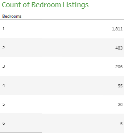

<h1 align="center">
     :house: Airbnb Listings Dashboard in Tableau
       
      

     :chart_with_upwards_trend: Data Visualization
</h1>
<h3>Introduction</h3>

The Airbnb Listings Dashboard is a comprehensive data visualization created in Tableau, showcasing insights from the 2016 Airbnb dataset for Seattle, Washington. The dataset comprises three tables: listings, reviews, and calendar, joined using the listingID. The dashboard provides an intuitive view of key metrics, such as average prices, listing distribution, and revenue trends, helping stakeholders better understand the dynamics of Airbnb rentals in Seattle.

The dataset is available via the following link: <a href="https://www.kaggle.com/datasets/alexanderfreberg/airbnb-listings-2016-dataset/data">Kaggle Link</a>. 
  
<h3>Key Visualizations and Insights</h3>
<ol>
  <li><b>Average Price by Number of Bedrooms</b></li>
  
  
Properties with <b>6 bedrooms</b> generate the highest average price at <b>€584.80</b>.   The trend indicates a decrease in average price as the number of bedrooms decreases. For example, single-bedroom properties have significantly lower average prices compared to larger properties.

  <li><b>Count of Listings by Number of Bedrooms</b></li>
  
  
The dataset shows <b>5 properties with 6 bedrooms</b>, a stark contrast to the <b>1,811 single-bedroom properties</b>.  The count of listings decreases as the number of bedrooms increases, suggesting a higher prevalence of smaller properties in the Airbnb market.

  <li><b>Average Price by Zipcode</b></li>
  
  
The highest average price is found in <b>zipcode 98119</b> at <b>€206.60</b>, followed by <b>98109</b> with <b>€171.11</b>.  The lowest average price is in <b>zipcode 98125</b>, at <b>€64.71</b>, highlighting a significant price disparity between neighborhoods.

  <li><b>Revenue by Month for the Year</b></li>
  
  
The highest revenue-generating months correspond to peak vacation periods, specifically <b>May, June, August</b>, and <b>December</b>.  This indicates a strong seasonal influence on Airbnb revenues, driven by holiday travel and summer vacations.

</ol>
<h3>Conclusion</h3>

The Tableau dashboard provides actionable insights into the Airbnb market in Seattle. By analyzing the relationships between property size, location, and revenue trends, stakeholders can make informed decisions about pricing strategies, investment opportunities, and seasonal demand planning. The visualization also highlights key patterns, such as the impact of neighborhood and property size on revenue potential, helping hosts and businesses optimize their offerings.

